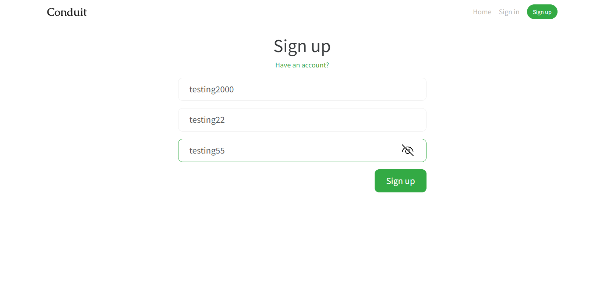
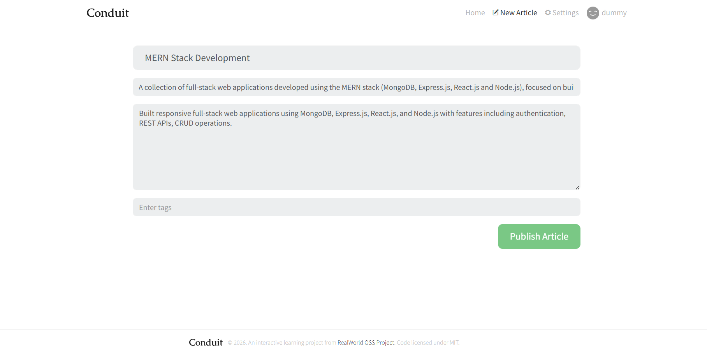
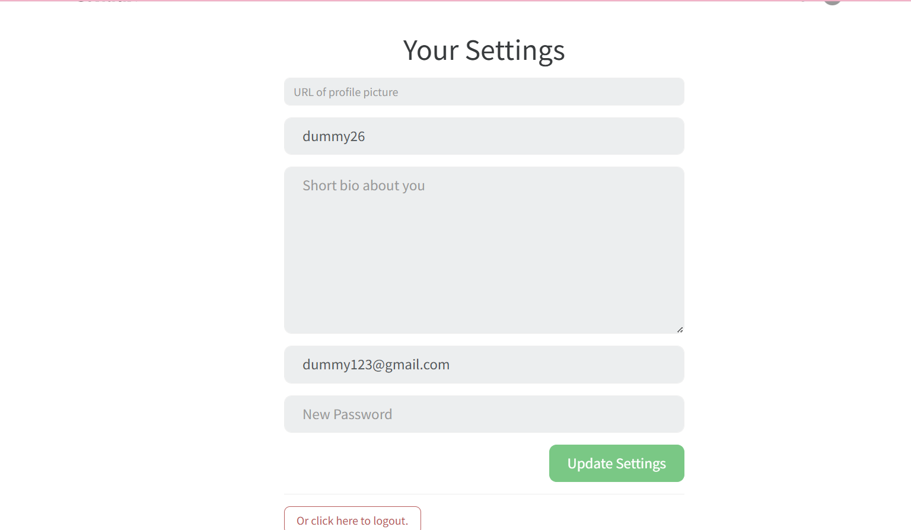
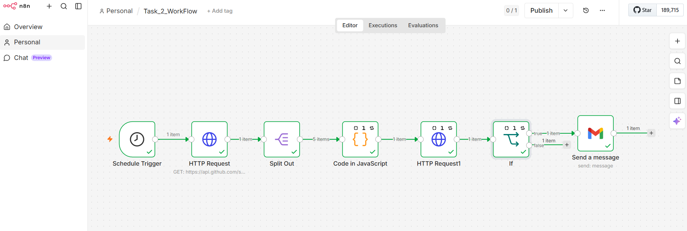
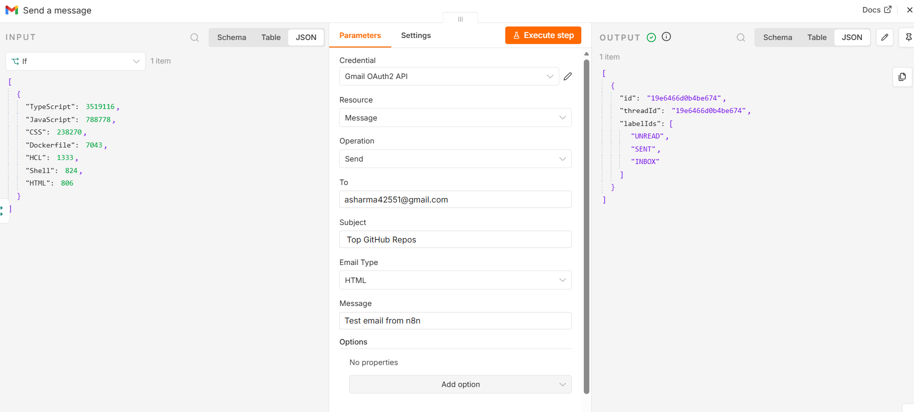

# 🧪 Automation & QA Assessment

## 👩‍💻 Candidate Information

**Name:** Ankita Sharma

---

# 📌 Task 1 – Web Application QA Testing

Performed manual QA testing on the RealWorld Demo Application to evaluate functionality, validation mechanisms, usability, and overall user experience.

---

## 🧾 Application Tested

- RealWorld Demo Application

---

## 🧪 Functionalities Tested

- User Signup
- User Sign In
- Article Creation
- Article Editing
- Article Deletion
- Profile Settings
- Logout Workflow

---

## 🐞 Issues Identified

1. Invalid email validation during signup
2. Weak password validation
3. Duplicate email signup handling
4. Missing confirmation popup for article actions
5. Article publishing/editing allowed without complete details
6. Missing login/logout success or confirmation messages

---

## 📦 Deliverables Included

- QA Report PDF
- Screenshots of identified issues
- Root Cause Analysis

---

## 🖼️ Screenshots – Task 1 QA Testing

### Invalid Email Validation Issue



### Article Publishing Without Complete Details



### Article Update Without Confirmation Popup



---

# ⚙️ Task 2 – n8n Workflow Automation

Implemented an automation workflow using n8n for API integration, data transformation, conditional handling, and notification delivery.

## ⚙️ Workflow Features

- **Trigger-Based Workflow Execution:** Automated execution using customizable timed schedule intervals.
- **API Integration:** Dynamic data queries leveraging multi-tiered external HTTP Request endpoints.
- **Data Filtering & Transformation:** Advanced mapping techniques using a JavaScript Code node to reduce data bloat.
- **Conditional Logic Handling:** Automated filtering based on an exact threshold parameter (`stars > 250000`).
- **Notification Workflow:** Live generation of responsive HTML email updates dispatched through a Gmail node.
- **Error Handling Implementation:** Structural resilience configurations to capture network anomalies gracefully without crashing the pipeline.

---

## 📋 API Implementation Details

### 1. Data Collection Endpoint (Primary API)

- **API Used:** GitHub Search API
- **Endpoint:** `https://api.github.com/search/repositories?q=language:javascript&sort=stars`
- **Purpose:** Collects top trending public repositories from GitHub based on popularity metrics.

### 2. Data Enrichment Endpoint (Secondary API)

- **API Used:** GitHub Repository Languages API
- **Endpoint:** `https://api.github.com/repos/{{ $json.owner.login }}/{{ $json.name }}/languages`
- **Purpose:** Takes contextual inputs from upstream nodes to pull down exact code metric profiles for each repository.

---

## 🖼️ Screenshots – Task 2 Automation

### Full Workflow Canvas View



### Successful Execution & Output Data



---

## 📁 Repository Contents

```text
README.md
Task1_QA_Report_AnkitaSharma(2026).pdf
Task_2_WorkFlow.json

QAImages/
  ├──QAImages/Task_2_Flow.png
  ├──QAImages/Task_Flow_2_Gmail.png


```
